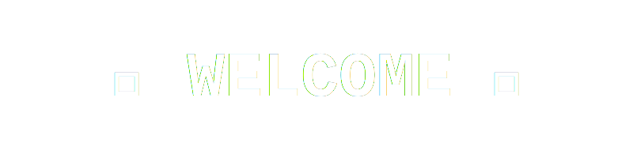

<!-- Banner -->

  

  

## 👋 Hi there, I'm Yutisio12

💡 **About Me**

🚀 Fullstack Engineer with experience across frontend, backend, and databases  
🌱 Actively developing with **Nest.Js, ReactJs, Next.js & Codeigniter**  
🛠 Strong focus on clean architecture, performance, and maintainable code  
🎯 Goal: *Build reliable, scalable applications that solve real-world problems*

---

## 🛠️ Tech Stack

  

  

  

  

---

## 📊 GitHub Stats

  
  

---

## 🌐 Connect with Me

  
  
  

